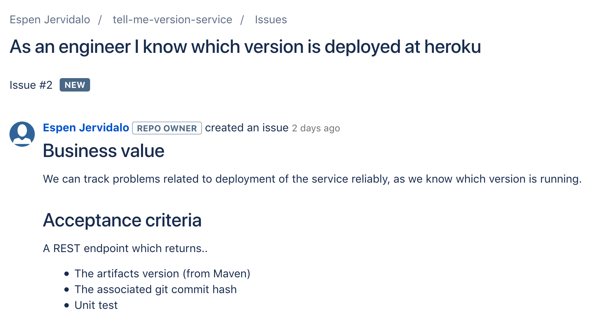

# Erfahrungsbericht Scrum

Note:
*   Check ob hörbar/sichtbar

----

## Agenda
*   Vorstellen
*   Scrum in der Praxis

Note:
*   Scrum erklären und mit Praxisbeispielen anreichern

----

## Bluesky IT-Solutions

<!-- .slide: data-background="./images/erfahrungsbericht/bluesky.jpg" -->

*   Standort Basel
*   Softwareentwicklung
*   18 Mitarbeiter

Note:
*   Java Fullstack und Web
*   Interne Projekte und IT-Consulting

----

## Stefani Gerber
*   Ausbildung
    *   Studium 2001-2007
    *   CAS HCID 2012 und 2016
*   Arbeiten
    *   Politools 2005 - 2011
    *   Mediaparx 2012
    *   Bluesky IT-Solutions seit 2012

----

## Meine Erfahrungen mit Scrum
*   Gelernt im Studium
*   Eingesetzt bei Bluesky

Note:
*   Kam nicht zum Einsatz bei meinen ersten zwei Stellen (2005-2012)
*   Bei Bluesky
    *   auf internen Projekten
    *   bei manchen Kunden
        *   einmal Transformation
        *   mehrfach wieder beim selben Kunden
        *   auf anderen Projekten nicht agil, z.T. alleine

----

## Projekt
Ablösung des Prämienrechners

Note:
*   CSS: eine Krankenkasse
*   letzter Einsatz bei der CSS
*   Ablösung: d.h. Neuentwicklung, mit Angular im Frontend und Java im Backend
*   ausserdem noch zuständig für Webseite

---

## Scrum is
> * Lightweight
> * Simple to understand
> * Difficult to master

> -- ScrumGuides.org

----

## Scrum ist ein Framework

*   Rollen
*   Ablauf/Meetings
*   Artefakte

Note:
*   komplexe Aufgaben
*   hochwertiges Produkt (wertsteigerndes zuerst umgesetzt)

----

<!-- .slide: data-background="./images/erfahrungsbericht/scrum-process.png" -->

Note:
*   Vorgehen im Überblick erklären, danach einzelne Elemente im Detail

---

## Artefakte
*   Product Backlog
*   Sprint Backlog
*   Increment

----

### Product Backlog
Geordnete Liste von allem, was für das Produkt nötig ist

Note:
*   Verantwortung vom Product Owner
*   enthält verschiedene Stufen (Epics, User Stories)
*   Quelle für Anforderungen

----

#### User Story

Note:
*   Struktur: Als <Rolle> will ich <Feature> um zu <Nutzen>
*   Akzeptanzkriterien

----

### Sprint Backlog
Der Teil des Product Backlog, der in diesem Sprint abgearbeitet wird.

 <!-- .element: class="fragment" -->

Note:
*   und der Plan, wie diese Punkte umgesetzt werden (Vorgehen)
*   Scrum Board

----

### Increment
Alles, was nach Sprintende erledigt ist (inkl. Increments der früheren Sprints)

Note:
*   Code, User Stories (falls separat durch RE abgearbeitet)

----

### Definition of Done

Gemeinsames Verständnis von _erledigt_

Note:
*   ausgedruckt aufgehängt
    *   alle Akzeptanzkriterien erfüllt
    *   getestet
    *   reviewed
*   nochmals durchgehen bevor man eine User Story abschliesst
*   anpassen wenn nötig

----

### Definition of Ready

Gemeinsames Verständnis von _bereit zur Umsetzung_

Note:
*   Kam immer wieder im Planning zur Sprache
*   Abhilfe: Backlog Refinement

---

## Rollen

*   Product Owner
*   Scrum Master
*   Development Team

Note:
Zeit: max. bei 20min
*   Product Owner Teilzeit, ist auch noch Autorin der Webseite
*   Scrum Master Teilzeit, ist auch noch Frontender
*   Abweichungen von Scrum
    *   fachliche Unterteilung der Devs
    *   1 Requirements Engineer
    *   2 Backend (+Architektur)
    *   3 Frontend

----

### Zusammenarbeit
*   mit Product Owner Sprint Meetings
*   mit Scrum Master nach Bedarf
*   innerhalb vom Development Team
    *   Code Reviews
    *   User Story besprechen mit Requirements Engineer

Note:
*   Zusammenarbeit im Entwicklerteam einfacher, weil im selben Raum
*   Code Reviews:
    *   selten pair programming
*   User Story:
    *   vorbesprechen oder Rückfragen während dem Umsetzen

----

### Kunden
*   Stakeholder innerhalb der Unternehmung
*   Endkunden

Note:
*   Stakeholder
    *   vorallem am Review Kontakt
    *   Product Owner ist da die Schnittstelle
*   Endkunden wenig einbezogen
    *   Feedback-Möglichkeiten
    *   kein User Centered Vorgehen

---

## Ablauf eines Sprint

*   Planning
*   Daily
*   Backlog Refinement
*   Sprint-Review
*   Retro

Note:
Zeit: max. bei 35min
*   Zeitspanne, in der ein fertiges, potentiell einsatzbereites Produktincrement erstellt wird

----

### Planning (Tag 1)

Ziel: Sprintinhalte planen

*   ganzes Team
*   Backlog (Product -> Sprint)
*   Commitment zu Sprint-Ziel
*   1-2h

Note:
*   Backlog priorisiert durch Product Owner
*   zusätzliche Tasks, falls noch genügend Zeit (!= Scrum)
*   Schätzen mit Planning Poker
*   1-2h
    * für 2-Wochensprint
    *   mit refined Backlog

----

### Daily Standup (täglich)

Ziel: Transparenz

*   time-boxed
*   3 Sätze
    *   was habe ich gestern gemacht
    *   was mache ich heute
    *   welche Probleme habe ich

Note:
*   täglich ist wichtig
*   time-boxed -> scrum master
    *   Charakter unterschiedlich -> sich kurz fassen nicht für alle gleich einfach
*   standup: wirklich aufstehen
    *   niemand töggelet noch was am Computer
    *   unbequem -> man macht nicht zu lange
*   nutzen, um Ansprüche an andere zu formulieren "Ich muss mit dir heute noch was anschauen"
*   allgemeine Infos erst nach der Runde
*   wichtig, dass Product Owner auch dabei ist
    *   weiss, was aktueller Stand ist

----

### Backlog Refinement (wöchentlich)
Ziel: Backlog besprechen
*   entlastet Planning
*   vorgängig User Stories reviewen
*   mehr Zeit für Abklärungen

Note:
*   Manchmal auch Grooming genannt
*   soviel ich weiss kein fixes Element in Scrum
*   Abhlife gegen sehr lange Plannings
*   Team nicht immer so isoliert wie in Theorie angedacht

----

### Sprint-Review (Tag n-1)
Ziel: präsentieren, was im Sprint umgesetzt wurde

Note:
*   Tag z.T. auch etwas variert, damit genügend Leute anwesend waren
*   Tag der Wahrheit

----

### Sprint-Review: Publikum
*   Stakeholder
*   z.T. auch andere Teams

Note:
*   Stakeholder waren je nach Sprint unterschiedlich
*   Präsentieren, Erwartungen managen

----

### Sprint-Review: Ablauf
*   Einleitung
*   einzelne User Stories zeigen
*   Möglichkeit für Feedback/Fragen
*   Ausblick durch Product Owner

Note:
*   User Stories zeigen: auch technische, um Verständnis zu fördern

----

### Retro
Ziel: sich als Team kontinuierlich verbessern

*   nur das Team
*   geschützter Rahmen
*   Impediments
*   abwechslungsreich gestaltet durch Scrum Master

Note:
*   Impediments
    *   Was hindert uns
    *   Entscheiden, welche Impediments man im nächsten Sprint beheben will
*   immer wieder dieselben Probleme haben führt oft zu
    *   Resignation
    *   Frustration
*   Beispiele
    *   wenn dieser Sprint ein Auto wäre, dann wäre er ...
    *   besonders gefallen/belastet hat mich diesen Sprint ...

---

<!-- .slide: data-background="./images/erfahrungsbericht/scrum-process.png" -->

Note:
*   Vorgehen im Überblick erklären, danach einzelne Elemente im Detail

---

## Links
-   <https://scrumguides.org>

---

## Danke fürs Zuhören

Fragen? <!-- .element: class="fragment" -->

Note:
*   LinkedIn, Xing, Visitenkarte
